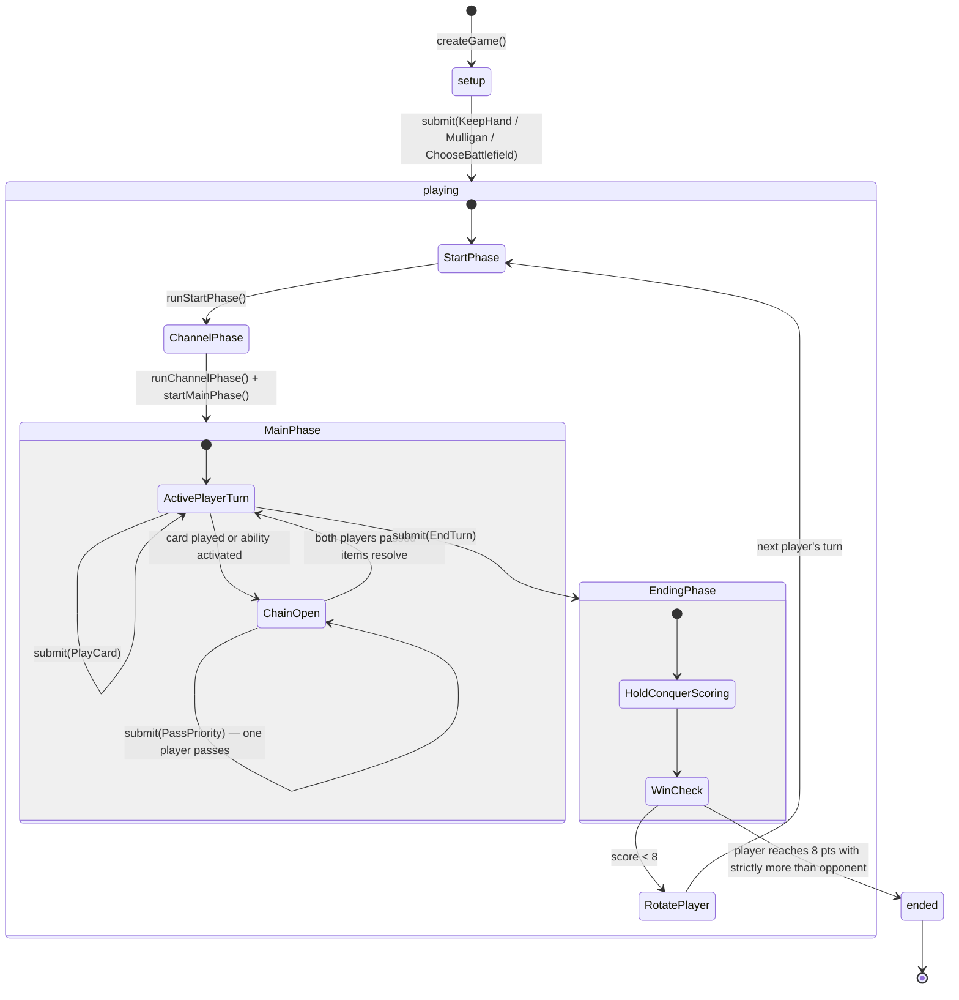

# Game Flow & Architecture

The engine is an **event-sourced reducer**. All game state lives in a plain `GameState` object — a regular JavaScript object you can `JSON.stringify` without ceremony. Every player action goes through `submit()`, which returns a new state and a list of events. Nothing mutates in place.

There is no live call stack. Multi-step resolution (effects that pause for player input, combat damage assignment, etc.) is modelled as an explicit `resolutionStack: StackFrame[]` on the state. When `state.pendingDecision` is set, the engine is waiting for a specific player response before it can continue.

## Package Dependencies

```
protocol
effect-ir    → protocol
card-catalog → protocol
card-compiler → effect-ir, card-catalog
engine       → protocol, effect-ir, card-catalog
test-helpers → engine, card-catalog, protocol  (dev only)
```

The critical constraint: `engine` must not import `card-compiler`. The engine is deployable without the parser toolchain — card text is compiled offline and stored as `EffectNode[]` programs in the card catalog. The TypeScript compiler enforces this via project references; it cannot be violated accidentally.

## Core API

| Function | What it does |
|---|---|
| `createGame(config)` | Validates decks, instantiates `CardInstance`s, shuffles with seeded RNG, deals opening hands — returns initial `GameState` with `status: 'setup'` and a `ChooseMulligan` pending decision |
| `submit(state, action, catalog)` | Applies one player action; returns `{ state, events }` |
| `legalActions(state, playerId, catalog)` | Lists every valid action for a player right now |
| `viewFor(state, playerId, catalog)` | Projects `GameState` into a `PlayerView` — opponent hand cards and face-down cards are redacted |
| `createMatchEngine(catalog)` | Binds a catalog to the per-game functions; returns match-level wrappers |

Automatic turn phases require no player input and are called directly by the game server:

| Function | Phase |
|---|---|
| `runStartPhase(state, query)` | Ready exhausted cards owned by active player; snapshot `holdEligible` battlefields |
| `runChannelPhase(state)` | Channel the top rune from the active player's rune deck into their rune pool |
| `startMainPhase(state)` | Open the main phase window |

## Game Lifecycle



**Pending decisions:** At any point, `state.pendingDecision` may be set. When it is, only the named player can act, and `legalActions` for all other players returns `[]`. Decisions include `ChooseMulligan`, `ChooseBattlefield`, `PriorityWindow`, `FocusWindow`, `ChooseTargets`, `ChooseYesNo`, `AssignDamage`, and `ChooseOne`.

**Showdowns:** A Showdown is a structured combat contest at a specific Battlefield. It uses Focus (tracked as `chain.focus`) instead of Priority. Focus is never conflated with Priority — they are separate concepts.

## Match Wrapper

A Match is a best-of-3 series. `createMatchEngine(catalog)` binds the catalog once and returns:

- `createMatch(config)` — initialises a `MatchState` with player decks, seed, and game-win tracking
- `submitToMatch(matchState, action)` — routes action to current game; starts the next game automatically when one ends
- `legalMatchActions(matchState, playerId)` — delegates to `legalActions` for the current game
- `viewForMatch(matchState, playerId)` — delegates to `viewFor` for the current game

## Typical Game Loop

```ts
import {
  createGame, submit, createRulesQuery,
  runStartPhase, runChannelPhase, startMainPhase,
} from '@thejokersthief/riftbound-engine'
import type { GameState } from '@thejokersthief/riftbound-engine'
import type { CardCatalog } from '@thejokersthief/riftbound-card-catalog'

function advanceTurnStart(state: GameState, catalog: CardCatalog): GameState {
  const query = createRulesQuery(state, catalog)
  state = runStartPhase(state, query).state
  state = runChannelPhase(state).state
  state = startMainPhase(state).state
  return state
}

while (state.status === 'playing') {
  const active = state.activePlayerId
  state = advanceTurnStart(state, catalog)

  // Game server delivers player actions until they submit EndTurn
  for (const action of getActionsFromPlayer(active)) {
    const result = submit(state, action, catalog)
    state = result.state
    // result.events contains GameEvent[] for this action
  }
}

console.log('Winner:', state.winner)
```

See [`examples/riftbound-example/src/index.ts`](../examples/riftbound-example/src/index.ts) for a fully annotated walkthrough including combat, chain exchanges, and scoring.
