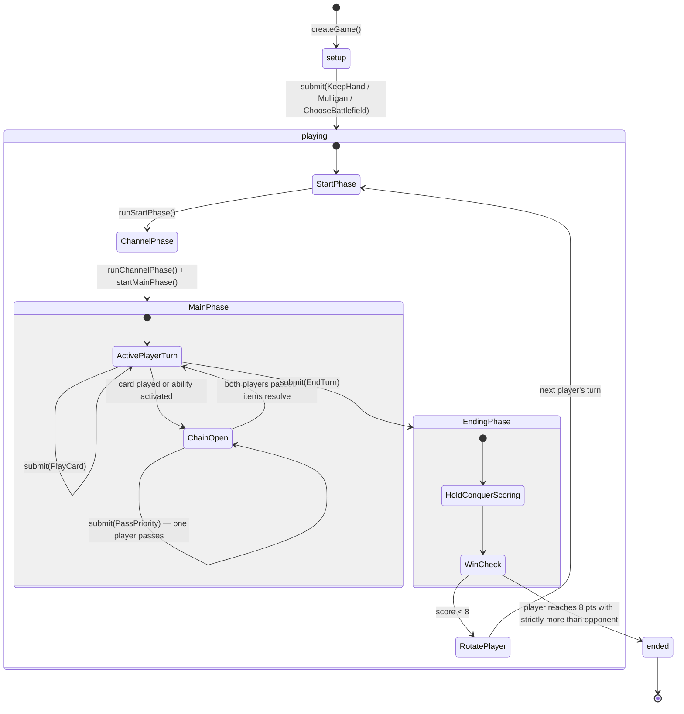

# Documentation Implementation Plan

> **For agentic workers:** REQUIRED SUB-SKILL: Use superpowers:subagent-driven-development (recommended) or superpowers:executing-plans to implement this plan task-by-task. Steps use checkbox (`- [ ]`) syntax for tracking.

**Goal:** Write four documentation files covering project overview, game flow, testing methodology, and dev environment setup.

**Architecture:** One file per concern — `README.md` at root, three supporting docs in `docs/`. Each doc is fully self-contained. No shared state between tasks; all four can be written independently.

**Tech Stack:** Markdown, Mermaid (stateDiagram-v2), TypeScript code snippets from the existing codebase.

---

## File Map

| File | Action |
|---|---|
| `README.md` | Modify (currently empty) |
| `docs/game-flow.md` | Create |
| `docs/testing.md` | Create |
| `docs/contributing.md` | Create |

---

### Task 1: README.md

**Files:**
- Modify: `README.md`

- [ ] **Step 1: Write README.md**

Replace the entire file with:

```markdown
# riftbound-rules-engine

A TypeScript rules engine for the Riftbound trading card game. Implements the 1v1 Match format (best-of-3) with fully serializable game state, offline-compiled card effects, and a deterministic seeded RNG.

- Fully serializable — `JSON.stringify` / `JSON.parse` round-trips losslessly; reconstruct any state from `initialState + orderedActions`
- Deterministic — same seed + same action sequence → byte-identical final state
- Offline-compiled card effects — the engine never parses card text at runtime
- 1v1 Match only (best-of-3) — other formats are out of scope for v1

## Packages

| Package | Description |
|---|---|
| `@thejokersthief/riftbound-protocol` | Shared wire types and branded IDs used by all packages |
| `@thejokersthief/riftbound-effect-ir` | Intermediate representation for compiled card effects |
| `@thejokersthief/riftbound-card-catalog` | Card definitions loaded from a JSON snapshot |
| `@thejokersthief/riftbound-card-compiler` | Parses card ability text into effect programs (build-time only) |
| `@thejokersthief/riftbound-engine` | Core rules engine — game state, turn flow, combat, chain resolution |

## Quick Start

```ts
import {
  createGame, submit, legalActions,
  runStartPhase, runChannelPhase, startMainPhase, createRulesQuery,
} from '@thejokersthief/riftbound-engine'
import { createCardCatalog, defaultSnapshotSource } from '@thejokersthief/riftbound-card-catalog'
import { toPlayerId, toCardDefId, toMatchId } from '@thejokersthief/riftbound-protocol'
import type { DeckConfig } from '@thejokersthief/riftbound-engine'

const catalog = await createCardCatalog(defaultSnapshotSource)

const myDeck: DeckConfig = {
  legendId: toCardDefId('ogs-017-024'),
  championId: toCardDefId('ogs-021-024'),
  battlefields: [toCardDefId('unl-t01'), toCardDefId('unl-t03'), toCardDefId('unl-205-219')],
  mainDeck: Array(40).fill(toCardDefId('ogn-001-298')),
  runeDeck: Array(10).fill(toCardDefId('ogn-007-298')),
}

const P1 = toPlayerId('alice')
const P2 = toPlayerId('bob')

let state = createGame({
  players: [P1, P2],
  decks: { [P1]: myDeck, [P2]: myDeck },
  seed: 42,
  matchId: toMatchId('match-1'),
})

// Mulligan
state = submit(state, { type: 'KeepHand', playerId: state.activePlayerId }, catalog).state

// Advance automatic turn phases (no player input)
const query = createRulesQuery(state, catalog)
state = runStartPhase(state, query).state
state = runChannelPhase(state).state
state = startMainPhase(state).state

// Player ends turn
state = submit(state, { type: 'EndTurn', playerId: state.activePlayerId }, catalog).state
```

## Documentation

- [Game Flow & Architecture](docs/game-flow.md) — how the engine works and how to drive a game loop
- [Testing Guide](docs/testing.md) — testing methodology and patterns
- [Contributing](docs/contributing.md) — dev environment setup and package boundaries

## Further Reading

- [`CONTEXT.md`](CONTEXT.md) — domain glossary (Match, Chain, Showdown, etc.)
- [`docs/adr/`](docs/adr/) — architectural decision records
- [`examples/riftbound-example/src/index.ts`](examples/riftbound-example/src/index.ts) — fully annotated game walkthrough
```

- [ ] **Step 2: Verify**

Open `README.md` and confirm:
- The quick-start snippet uses only exports that exist (`createGame`, `submit`, `legalActions`, `runStartPhase`, `runChannelPhase`, `startMainPhase`, `createRulesQuery` from engine; `createCardCatalog`, `defaultSnapshotSource` from card-catalog)
- All three doc links point to files that will exist after Tasks 2–4
- The packages table matches the five packages in the repo

- [ ] **Step 3: Commit**

```bash
git add README.md
git commit -m "docs: write README with packages table and quick start"
```

---

### Task 2: docs/game-flow.md

**Files:**
- Create: `docs/game-flow.md`

- [ ] **Step 1: Write docs/game-flow.md**

```markdown
# Game Flow & Architecture

The engine is an **event-sourced reducer**. All game state lives in a plain `GameState` object — a regular JavaScript object you can `JSON.stringify` without ceremony. Every player action goes through `submit()`, which returns a new state and a list of events. Nothing mutates in place.

There is no live call stack. Multi-step resolution (effects that pause for player input, combat damage assignment, etc.) is modelled as an explicit `resolutionStack: StackFrame[]` on the state. When `state.pendingDecision` is set, the engine is waiting for a specific player response before it can continue.

## Package Dependencies

```
protocol
effect-ir    → protocol
card-catalog → protocol
card-compiler → effect-ir, card-catalog
engine       → protocol, effect-ir, card-catalog
test-helpers → engine, card-catalog, protocol  (dev only)
```

The critical constraint: `engine` must not import `card-compiler`. The engine is deployable without the parser toolchain — card text is compiled offline and stored as `EffectNode[]` programs in the card catalog. The TypeScript compiler enforces this via project references; it cannot be violated accidentally.

## Core API

| Function | What it does |
|---|---|
| `createGame(config)` | Validates decks, instantiates `CardInstance`s, shuffles with seeded RNG, deals opening hands — returns initial `GameState` with `status: 'setup'` and a `ChooseMulligan` pending decision |
| `submit(state, action, catalog)` | Applies one player action; returns `{ state, events }` |
| `legalActions(state, playerId, catalog)` | Lists every valid action for a player right now |
| `viewFor(state, playerId, catalog)` | Projects `GameState` into a `PlayerView` — opponent hand cards and face-down cards are redacted |
| `createMatchEngine(catalog)` | Binds a catalog to the per-game functions; returns match-level wrappers |

Automatic turn phases require no player input and are called directly by the game server:

| Function | Phase |
|---|---|
| `runStartPhase(state, query)` | Ready exhausted cards owned by active player; snapshot `holdEligible` battlefields |
| `runChannelPhase(state)` | Channel the top rune from the active player's rune deck into their rune pool |
| `startMainPhase(state)` | Open the main phase window |

## Game Lifecycle



**Pending decisions:** At any point, `state.pendingDecision` may be set. When it is, only the named player can act, and `legalActions` for all other players returns `[]`. Decisions include `ChooseMulligan`, `ChooseBattlefield`, `PriorityWindow`, `FocusWindow`, `ChooseTargets`, `ChooseYesNo`, `AssignDamage`, and `ChooseOne`.

**Showdowns:** A Showdown is a structured combat contest at a specific Battlefield. It uses Focus (tracked as `chain.focus`) instead of Priority. Focus is never conflated with Priority — they are separate concepts.

## Match Wrapper

A Match is a best-of-3 series. `createMatchEngine(catalog)` binds the catalog once and returns:

- `createMatch(config)` — initialises a `MatchState` with player decks, seed, and game-win tracking
- `submitToMatch(matchState, action)` — routes action to current game; starts the next game automatically when one ends
- `legalMatchActions(matchState, playerId)` — delegates to `legalActions` for the current game
- `viewForMatch(matchState, playerId)` — delegates to `viewFor` for the current game

## Typical Game Loop

```ts
import {
  createGame, submit, createRulesQuery,
  runStartPhase, runChannelPhase, startMainPhase,
} from '@thejokersthief/riftbound-engine'
import type { GameState } from '@thejokersthief/riftbound-engine'
import type { CardCatalog } from '@thejokersthief/riftbound-card-catalog'

function advanceTurnStart(state: GameState, catalog: CardCatalog): GameState {
  const query = createRulesQuery(state, catalog)
  state = runStartPhase(state, query).state
  state = runChannelPhase(state).state
  state = startMainPhase(state).state
  return state
}

while (state.status === 'playing') {
  const active = state.activePlayerId
  state = advanceTurnStart(state, catalog)

  // Game server delivers player actions until they submit EndTurn
  for (const action of getActionsFromPlayer(active)) {
    const result = submit(state, action, catalog)
    state = result.state
    // result.events contains GameEvent[] for this action
  }
}

console.log('Winner:', state.winner)
```

See [`examples/riftbound-example/src/index.ts`](../examples/riftbound-example/src/index.ts) for a fully annotated walkthrough including combat, chain exchanges, and scoring.
```

- [ ] **Step 2: Verify**

Check that:
- The Mermaid diagram is valid `stateDiagram-v2` syntax (no unclosed states, consistent arrow syntax)
- All function names in the API table (`runStartPhase`, `runChannelPhase`, `startMainPhase`, `createRulesQuery`, `viewFor`, `createMatchEngine`) match actual exports in `packages/engine/src/index.ts`
- The relative link to the example file is correct: `../examples/riftbound-example/src/index.ts`

- [ ] **Step 3: Commit**

```bash
git add docs/game-flow.md
git commit -m "docs: add game flow and architecture guide"
```

---

### Task 3: docs/testing.md

**Files:**
- Create: `docs/testing.md`

- [ ] **Step 1: Write docs/testing.md**

```markdown
# Testing Guide

Tests in this repo assert **rules correctness** — that the engine behaves the way the Riftbound rulebook says it should. Code coverage is a side-effect, not the goal.

## Setup

The test suite lives in `packages/engine/src/__tests__/` (engine tests) and `packages/*/src/` (per-package tests). All tests use [Vitest](https://vitest.dev/).

The card catalog is loaded once per suite using Vitest's `beforeAll`:

```ts
import { createCardCatalog, defaultSnapshotSource } from '@thejokersthief/riftbound-card-catalog'
import type { CardCatalog } from '@thejokersthief/riftbound-card-catalog'

let catalog: CardCatalog

beforeAll(async () => {
  catalog = await createCardCatalog(defaultSnapshotSource)
})
```

Most tests use `buildBoard` and `buildDeck` from `@thejokersthief/riftbound-test-helpers` to construct a `GameState` directly — bypassing `createGame` and mulligan so tests start at the exact board position they need:

```ts
import { buildBoard } from '@thejokersthief/riftbound-test-helpers'
import { toPlayerId } from '@thejokersthief/riftbound-protocol'

const P1 = toPlayerId('p1')
const P2 = toPlayerId('p2')

const state = buildBoard({
  players: [P1, P2],
  catalog,
  board: {
    [P1]: { points: 7, resources: { energy: 3, power: 5 } },
    [P2]: { points: 0 },
  },
})
```

## Running Tests

```bash
pnpm test          # single run, all packages
pnpm test:watch    # watch mode
```

## Techniques

### Module Unit Tests

Each engine concern has its own test file:

| File | What it covers |
|---|---|
| `chain.test.ts` | Priority passing, chain open/close, item resolution order |
| `turn.test.ts` | Start / Channel / Main / Ending phase transitions |
| `combat.test.ts` | Damage assignment, unit death, control changes |
| `rules-query.test.ts` | Stat resolution via the 5-layer dependency graph |
| `visibility.test.ts` | Opponent info redaction in `viewFor` |
| `interpreter.test.ts` | Effect program execution |
| `facade.test.ts` | Full `submit` dispatch for each action type |
| `match.test.ts` | Match-level game-win tracking and between-game setup |

Tests use `buildBoard` to set up only what the test needs, then call `submit` directly and assert on the returned `state` and `events`.

### Scenario Runner

`runScenario` from `test-helpers` lets you express a test as: initial state + ordered action sequence + assertion. The `rules` field cites the relevant rulebook section, making it easy to trace a failing test back to the rule it's testing.

```ts
import { buildBoard, runScenario } from '@thejokersthief/riftbound-test-helpers'
import { toBattlefieldId, toPlayerId } from '@thejokersthief/riftbound-protocol'

const P1 = toPlayerId('p1')
const P2 = toPlayerId('p2')
const BF = toBattlefieldId('bf-p1')

runScenario({
  name: 'Hold scoring awards 1 point for a battlefield controlled at start and end of turn',
  rules: ['core 312.4'],
  catalog,
  initial: buildBoard({
    players: [P1, P2],
    catalog,
    board: { [P1]: { points: 0 }, [P2]: { points: 0 } },
    battlefields: { [BF]: { controllerId: P1 } },
  }),
  actions: [{ type: 'EndTurn', playerId: P1 }],
  assert: ({ finalState }) => {
    expect(finalState.players[P1]?.points).toBe(1)
  },
})
```

### Invariant Tests

`invariants.test.ts` asserts properties that must hold regardless of what actions are taken — not for a specific board position, but as engine-wide guarantees:

- Points never decrease during a game
- A game with `status: 'ended'` ignores further `submit` calls
- `pendingDecision` is cleared after a valid response action
- `activePlayerId` is always one of the two declared players

### Fuzz Tests

`fuzz.test.ts` runs multiple seeded games. Each step picks a random legal action from `legalActions`. The test asserts no unhandled exceptions at any point:

```ts
import { FUZZ_ITERATIONS, playFuzzGame } from '@thejokersthief/riftbound-test-helpers'

it('does not throw across multiple seeds', () => {
  const REDUCED = Math.min(FUZZ_ITERATIONS, 20)
  for (let seed = 0; seed < REDUCED; seed++) {
    expect(() => playFuzzGame(seed, catalog, 100)).not.toThrow()
  }
})
```

`playFuzzGame` uses a deterministic pick function (not `Math.random`) so failures are reproducible by seed.

### Determinism Tests

`determinism.test.ts` replays the same seed and action sequence twice and asserts the final states are deep-equal. This catches any accidental use of `Math.random()` or `Date.now()` anywhere in the engine:

```ts
import { playFuzzGame } from '@thejokersthief/riftbound-test-helpers'

it('produces identical states for the same seed', () => {
  const r1 = playFuzzGame(42, catalog, 200)
  const r2 = playFuzzGame(42, catalog, 200)
  expect(r1.matchState.currentGame).toEqual(r2.matchState.currentGame)
})
```

## test-helpers Reference

`@thejokersthief/riftbound-test-helpers` is a dev-only package (never deployed to production). It exports:

| Export | Purpose |
|---|---|
| `buildDeck(overrides?)` | Returns a valid `DeckConfig` using real card IDs from `cards.json` |
| `buildBoard(config)` | Constructs a `GameState` at a specific board position without running through `createGame` |
| `buildMatch(config)` | Constructs a `MatchState` ready to receive actions |
| `runScenario(scenario)` | Runs an action sequence and calls `assert` on the result |
| `playFuzzGame(seed, catalog, maxActions)` | Plays a full game picking random legal actions at each step |
| `expectEvent(events, partial)` | Asserts an event matching the partial shape exists in the list |
| `expectNoEvent(events, type)` | Asserts no event of the given type exists in the list |
| `FUZZ_ITERATIONS` | Default number of seeds for fuzz tests (100) |
```

- [ ] **Step 2: Verify**

Check that:
- All `test-helpers` exports listed in the reference table match actual exports in `packages/test-helpers/src/index.ts` (`buildDeck`, `buildBoard`, `buildMatch`, `runScenario`, `playFuzzGame`, `expectEvent`, `expectNoEvent`, `FUZZ_ITERATIONS`)
- The fuzz test snippet matches the pattern in the actual `fuzz.test.ts`
- `cards.json` path in the `buildDeck` description is correct (`packages/card-catalog/data/cards.json`)

- [ ] **Step 3: Commit**

```bash
git add docs/testing.md
git commit -m "docs: add testing methodology guide"
```

---

### Task 4: docs/contributing.md

**Files:**
- Create: `docs/contributing.md`

- [ ] **Step 1: Write docs/contributing.md**

```markdown
# Contributing

## Prerequisites

- Node 20+
- pnpm 9+

## Install

```bash
pnpm install
```

That's it. No additional setup required.

## Common Commands

| Command | What it does |
|---|---|
| `pnpm test` | Run all tests once |
| `pnpm test:watch` | Run tests in watch mode |
| `pnpm typecheck` | Type-check all packages via TypeScript project references |
| `pnpm lint` | Lint all packages (Biome + oxlint) |
| `pnpm --filter @thejokersthief/riftbound-example start` | Run the annotated example walkthrough |

## Package Boundaries

The dependency graph is enforced by **TypeScript project references** — the compiler rejects imports that cross undeclared boundaries. You cannot accidentally break it.

```
protocol
effect-ir    → protocol
card-catalog → protocol
card-compiler → effect-ir, card-catalog
engine       → protocol, effect-ir, card-catalog
test-helpers → engine, card-catalog, protocol  (dev only)
```

The critical constraint: `engine` must not import `card-compiler`. The engine is deployable without the parser toolchain. Adding any cross-package dependency requires a deliberate edit to the `tsconfig.json` in the importing package — the compiler will reject the import otherwise.

## Adding a Card

Edit `packages/card-catalog/data/cards.json`. No engine changes needed — the catalog reads from this snapshot at runtime via `defaultSnapshotSource`. If the card has ability text, the card-compiler package parses it into an `EffectNode[]` program at build time.

## Key Directories by Concern

| Concern | Location |
|---|---|
| Turn phases (Start, Channel, Main, Ending, Cleanup) | `packages/engine/src/turn/` |
| Chain resolution and priority | `packages/engine/src/chain/` |
| Combat and showdowns | `packages/engine/src/combat/` |
| Stat resolution (5-layer dependency graph) | `packages/engine/src/rules-query/` |
| State events and `fold` reducer | `packages/engine/src/state/` |
| Effect interpreter | `packages/engine/src/interpreter/` |
| Player view projection (`viewFor`) | `packages/engine/src/visibility/` |
| Match-level orchestration | `packages/engine/src/match/` |
| Wire types and branded IDs | `packages/protocol/src/` |
| Card ability text parser | `packages/card-compiler/src/` |
| Card definitions | `packages/card-catalog/data/cards.json` |

## Running the Example

```bash
pnpm --filter @thejokersthief/riftbound-example start
```

The file at `examples/riftbound-example/src/index.ts` walks through a full game from `createGame` to `status: 'ended'`, with inline comments explaining every call. It's the best starting point for understanding how the engine fits together.

## Further Reading

- [`CONTEXT.md`](../CONTEXT.md) — domain glossary (Match, Chain, Showdown, FEPR, etc.)
- [`docs/adr/`](adr/) — architectural decision records explaining key design choices
- [`docs/game-flow.md`](game-flow.md) — engine architecture and game lifecycle diagram
- [`docs/testing.md`](testing.md) — testing methodology and test-helpers reference
```

- [ ] **Step 2: Verify**

Check that:
- All directory paths in the "Key Directories" table exist: `packages/engine/src/turn/`, `packages/engine/src/chain/`, `packages/engine/src/combat/`, `packages/engine/src/rules-query/`, `packages/engine/src/state/`, `packages/engine/src/interpreter/`, `packages/engine/src/visibility/`, `packages/engine/src/match/`
- Relative links to `CONTEXT.md`, `adr/`, `game-flow.md`, `testing.md` are correct from the `docs/` directory
- `pnpm --filter @thejokersthief/riftbound-example start` matches the script name in `examples/riftbound-example/package.json`

- [ ] **Step 3: Commit**

```bash
git add docs/contributing.md
git commit -m "docs: add contributing and dev environment guide"
```

---

## Self-Review

**Spec coverage:**
- README with packages table and quick start → Task 1 ✓
- game-flow.md with Mermaid diagram → Task 2 ✓
- testing.md with all five techniques → Task 3 ✓
- contributing.md with prerequisites, commands, boundaries → Task 4 ✓
- Links between docs → covered in each task ✓
- Link to CONTEXT.md and ADRs → README Task 1, contributing.md Task 4 ✓

**Placeholder scan:** No TBDs, no "implement later", no vague steps. All code blocks show complete content.

**Type consistency:** No shared types between tasks — each task writes a standalone doc file. No cross-task type references.
